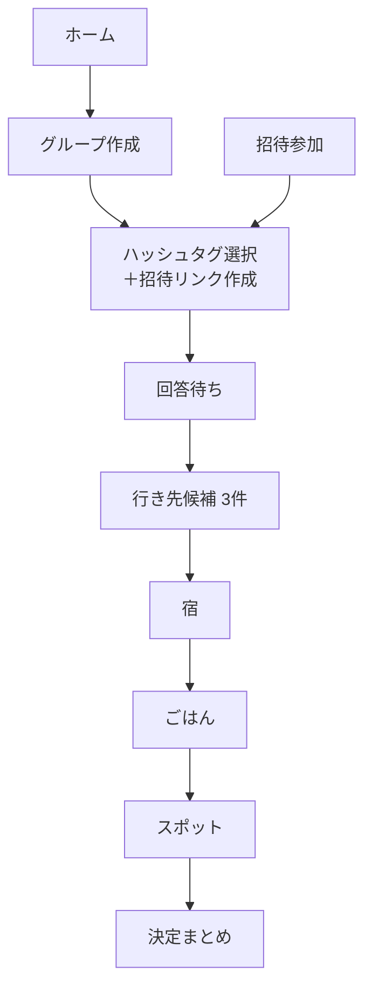
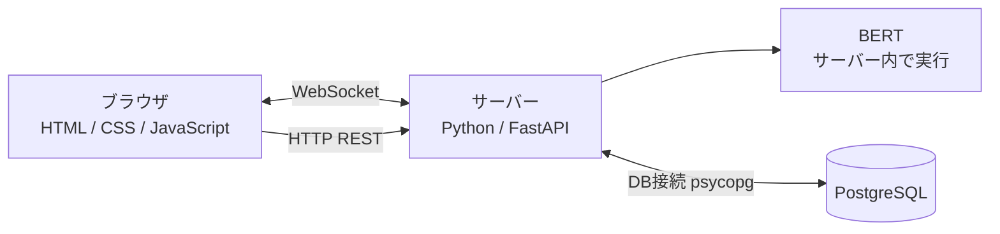

# いこたび 仕様書B

13班「えびちり」／2026年9月

本書は仕様書Aをもとに、A だけでは決められなかった17の要判断ポイント（Q1〜Q17）をチームの回答で確定させた版である。内容は実装（`ikotabi.zip`）と一致している。各項目がどの回答によって決まったかは【Qn】で示し、回答の一覧は10章にまとめた。

---

## 1. 課題背景

今回のテーマ「動詞＋ない」のうち、一言で表すと **「誘えない」** を課題として定めた。

グループ旅行や家族旅行では、メンバーそれぞれが旅行に求めるものに差があり、その溝を埋めるのに時間がかかる。原因は、個人の希望を集めて一つにまとめる手段が不足していることにある。

## 2. サービス概要

いこたびは、2〜4人のグループ旅行で、メンバー全員の希望を集めて AI で行き先・宿・ごはん・スポットを決める Web サービスである。

1. 幹事がグループを作り、名前・日程・人数を入力する。【Q1・Q5】
2. 友達ごとに招待リンクを作って送る。リンクは1人1回まで使える。【Q15】
3. 友達はリンクを開き、ニックネームだけで参加する。アカウントは不要。【Q3】
4. 各メンバーが4つの質問に答え、AI が用意したハッシュタグから希望を選ぶ。【Q6】
5. 全員の回答がある程度そろったら、AI が行き先の候補を3件出す。【Q8・Q10】
6. 行き先 → 宿 → ごはん → スポットの順に全員で投票して決める。【Q2・Q7】
7. 決定まとめで、旅の内容と「全員の希望がそれぞれかなったか」を確認する。

予約サイトへの送客は行わない。宿泊・食事・観光地を決めるところまでを範囲とする。【Q7】

## 3. 提供価値

| 利用者 | 価値 |
| --- | --- |
| 幹事（誘う人） | 希望のすり合わせが楽になり、旅行に誘いやすくなる |
| 参加者 | 自分の希望がかないやすくなる。誰か一人の意見ばかりが通ることがない |

## 4. 画面遷移と画面仕様

### 4.1 画面遷移図



仕様書Aの5画面に、「招待参加」「回答待ち」「宿」「ごはん」「スポット」「決定まとめ」を加えた。【Q4・Q7】アカウントを作らないため、ログイン画面は置かない。【Q3】

### 4.2 画面仕様

| 画面 | 表示するもの | 操作 → 遷移先 |
| --- | --- | --- |
| ホーム | 「旅行グループをつくる」ボタン、この端末で参加中のグループ一覧（日程と進み具合） | つくる → グループ作成 ／ グループ → そのグループの現在の画面 |
| グループ作成 | グループ名（20文字まで）、日程（出発日・帰る日）、人数（2〜4人）、自分のニックネーム | 作成 → ハッシュタグ選択 |
| 招待参加 | グループ名、日程、参加人数／定員、ニックネーム入力 | 参加する → ハッシュタグ選択 ／ 参加しない → ホーム |
| ハッシュタグ選択 | 4つの質問とタグ、「自分が選んだタグをメンバーに見せる」の切り替え。幹事には招待リンクの作成欄も表示 | この希望で決定 → 回答待ち |
| 回答待ち | メンバーの回答状況（回答済み n/m人）、公開を選んだ人のタグ | 全員回答で自動的に行き先候補へ ／ 幹事は2人以上回答で「今いるメンバーの希望で行き先を探す」 ／ 希望を直す |
| 行き先候補 | 候補3件（都道府県・エリア・マッチ度・「N人中M人の希望にマッチ」・理由文・票数） | 投票 → 全員投票で宿へ ／ 幹事は「今の投票で決める」 |
| 宿 | 宿の候補（名前・タグ・料金の目安・マッチ度・理由文） | 1票投票 → 全員投票でごはんへ |
| ごはん | ごはんの候補（名前・タグ・料金の目安） | 2つまで投票 → 全員投票でスポットへ |
| スポット | スポットの候補（名前・タグ・料金の目安・チケットの要否） | 3つまで投票 → 全員投票で決定まとめへ |
| 決定まとめ | 行き先・宿・ごはん・スポット、メンバーごとのかなった希望の数 | ホームへ |

全画面の上部に4段の進み具合（希望 → 行き先 → 宿・ごはん → スポット）を表示する。他のメンバーが回答・投票すると、WebSocket で全員の画面が自動で更新される。

## 5. 機能要件

| ID | 機能 | 根拠 |
| --- | --- | --- |
| F-01 | グループ名・日程・人数（2〜4人）を入力してグループを作成できる。作成者が幹事になる | Q1・Q5 |
| F-02 | 幹事が友達ごとに招待リンクを作成できる。リンクは1回使うと無効になる。未使用のリンクと参加者の合計は定員まで | Q15 |
| F-03 | 招待リンクから、ニックネームだけで参加できる。参加中のグループは端末に保存される | Q3 |
| F-04 | 4つの質問それぞれで1つ以上ハッシュタグを選んで希望を保存できる。自由入力はない | Q6 |
| F-05 | 自分のタグをメンバーに見せるかどうかを選べる（初期は非公開）。非公開の人は「回答済み」とだけ表示される | Q16 |
| F-06 | 定員がそろって全員が回答したら、自動で行き先候補を出す。幹事は2人以上が回答した時点で先に進められる | Q8 |
| F-07 | 行き先候補を3件、マッチ度と「N人中M人の希望にマッチ」付きで表示する | Q9・Q10 |
| F-08 | 各候補に、なぜその候補なのかの理由文を表示する | Q11 |
| F-09 | 行き先・宿・ごはん・スポットに投票できる。全員が投票すると自動で決まり、幹事はいつでも締め切れる | Q2 |
| F-10 | ごはん・スポットは、全員の「いいね」が1つ以上入るように選ぶ | Q2 |
| F-11 | 決定まとめで、メンバーごとにかなった希望の数を表示する | Q2 |
| F-12 | 行き先が決まった後、宿泊・食事・観光地の候補を出す。予約サイトへは送らない | Q7 |
| F-13 | 回答・投票・決定を WebSocket で全員の画面に即時反映する | 仕様書A |

### 5.1 ハッシュタグ

AI が場所や最近の旅行トレンドをもとに用意した65語を、4つの質問に分ける。【Q6】

| 質問 | タグの例 | 判定方法 |
| --- | --- | --- |
| どんな旅行にしたい？ | 節約、3〜5万円、6〜8万円、贅沢に、のんびり、アクティブ、弾丸旅、非日常、エモい、推し活 | 予算の4つはルールで判定、ほかは BERT |
| どこ行きたい？ | 北海道〜沖縄の9地域、近場、海のある所、山のある所、都会、島 | 地域と「近場」はルール（近場＝東京から行きやすい関東と山梨・静岡）、ほかは BERT |
| なにやりたい？ | 温泉、食べ歩き、海鮮、絶景、夜景、歴史・寺社、テーマパーク、写真映え、聖地巡礼、サウナなど25語 | BERT |
| どんなところに泊まりたい？ | 温泉付き、露天風呂、旅館、おしゃれ、ゲストハウス、コスパ重視、グランピング、ゲーセンありなど16語 | BERT |

予算はグループ作成時には聞かず、このタグで扱う。【Q5】

### 5.2 マッチングの考え方

行き先・宿・ごはん・スポットは、AI が生成したデータ（47都道府県と、宿・ごはん・スポット計423件）から選ぶ。【Q17】

**1. タグと候補の近さ（BERT）**
タグと候補の説明文を BERT でベクトル化し、コサイン類似度で意味の近さを測る。候補に同じタグが付いていれば1.0点、付いていなければ意味の近さに応じて最大0.7点とする。

**2. メンバーごとの適合度**

```
適合度 = 0.60 × タグの近さ ＋ 0.25 × 地域が合うか ＋ 0.15 × 予算が合うか
```

地域は選んだ地域に含まれれば1、含まれなければ0。予算は一致で1、1段ずれで0.5、それ以外は0。

**3. グループのスコア（平均と最低の組み合わせ）**【Q9】

```
スコア = 0.5 × 平均 ＋ 0.3 × 一番低い人の適合度 ＋ 0.2 × (1 − 最高と最低の差)
```

平均だけで決めると、多数派の希望ばかりが通る。「一番低い人」と「ばらつき」を入れることで、誰かが我慢する候補を下げる。マッチ度（％）はこのスコアを100倍したもの。

**4. 絞り込み**
誰かが選んだ地域に含まれる都道府県だけを候補にする。3件に満たないときは地域の条件を外し、画面にその旨を表示する。上位3件を出す。【Q10】

「N人中M人の希望にマッチ」の M は、選んだタグが候補にそのまま付いていて、地域と予算も外れていない人の数。

### 5.3 決め方（全員の希望を1つずつ通す）【Q2】

| 項目 | 1人の投票数 | 決める数 | 決め方 |
| --- | --- | --- | --- |
| 行き先 | 1 | 1 | 票が最も多い候補。同数ならスコアが高い方 |
| 宿 | 1 | 1 | 同上 |
| ごはん | 2まで | 2 | まず全員の「いいね」が1つ以上入るように選び、残りを票数順で埋める |
| スポット | 3まで | 3 | 同上 |

たとえば2人がAとB、1人がCを選んだ場合、票数だけならAとBになるが、いこたびでは3人目の希望Cを必ず入れてAとCにする。決定まとめでは、行き先で希望がかなったか、宿・ごはん・スポットで自分の投票したものが選ばれたかを数え、メンバーごとに表示する。

### 5.4 理由文【Q11】

候補ごとに「なぜこの候補なのか」を2〜3文で表示する。LLM は使わず、次のテンプレートで作る（API キー不要）。

> 「温泉」「のんびり」を選んだ人が多く、箱根・鎌倉・横浜ならその希望をかなえられます。（行き先の説明文）3人中2人の希望がそのままかないます。

誰がどのタグを選んだかは理由文に含めない。

## 6. アーキテクチャ

### 6.1 構成図



### 6.2 採用技術と理由

| 技術 | 用途 | 採用理由 |
| --- | --- | --- |
| Python / FastAPI | サーバーと AI | AI を Python で書くため、サーバーも同じ Python にまとめた。AI を別のサーバーに分けず、同じプログラムの中で呼び出す【Q13】 |
| WebSocket | ブラウザとサーバーの通信 | 回答・投票・決定を全員の画面に即時反映する |
| HTTP（REST） | データの読み書き | 画面からの保存・取得に使う |
| BERT | マッチング | 意味の近い言葉を近い数値にできる。日本語 Sentence-BERT（`sonoisa/sentence-bert-base-ja-mean-tokens-v2`）を使う |
| PostgreSQL | データの保存 | グループ・メンバー・タグ・投票の関係を表で管理できる |
| HTML / CSS / JavaScript | 画面 | ブラウザで動く言語は JavaScript しかないため、画面だけは JavaScript。ビルド不要の素の JavaScript にして、道具を増やさない |

- 【Q12】仕様書Aではサーバーと DB の間も WebSocket としていたが、PostgreSQL は WebSocket で接続する仕組みを持たないため、この区間は通常の DB 接続（psycopg）とした。WebSocket はブラウザとサーバーの間で使う。
- 【Q14】Redis は使わない。BERT のベクトルはサーバー起動時に計算してメモリに持つ。サーバー1台のハッカソン規模では、これで十分な速さになる。

## 7. データベース

仕様書Aの8テーブルをもとに、アカウント不要【Q3】、招待リンクの再発行【Q15】、回答の公開設定【Q16】、宿・ごはん・スポット【Q7】、投票と決定【Q2】に合わせて変更した。

| テーブル | 主なカラム | 仕様書Aからの変更 |
| --- | --- | --- |
| groups | id, name, start_date, end_date, member_limit, status | owner_id を削除（幹事はメンバーのロールで表す）。人数と進み具合を追加 |
| group_members | id, group_id, nickname, role（host / member）, token_hash, share_answers, answered_at | users の代わり。ニックネームとグループ専用のトークンで本人を見分ける |
| invites | id, group_id, token_hash, used_at, used_by | groups.invite_token を分離。1リンクを1回だけ使える |
| hashtag_categories | id, key, label | key を追加 |
| hashtags | id, category_id, label, kind（semantic / region / budget）, value | 判定方法を追加 |
| user_hashtag_selections | id, group_id, member_id, hashtag_id | user_id → member_id |
| destinations | id, prefecture, area, region, near, band, description, tags | 地域・近場・予算帯・説明文・タグを追加。ベクトルは DB に置かずメモリに持つ |
| places | id, destination_id, type（lodging / food / spot）, name, tags, price, ticket | 新規 |
| matching_results | id, group_id, target_type, target_id, rank, score, matched_count, reason_text | 対象の種類・順位・マッチ人数を追加 |
| votes | id, group_id, member_id, target_type, target_id | 新規 |
| decisions | id, group_id, target_type, target_id | 新規 |

`status` は collecting（希望集め）→ destination → lodging → food → spot → done の順に進む。

## 8. API

| メソッド | パス | 用途 |
| --- | --- | --- |
| POST | /api/groups | グループ作成 |
| GET | /api/groups/{id} | グループの状態・メンバー・回答状況 |
| POST | /api/groups/{id}/invites | 招待リンク作成（幹事のみ） |
| GET | /api/invites/{token} | 招待内容の確認 |
| POST | /api/invites/{token}/join | 参加 |
| GET | /api/tags | ハッシュタグ一覧 |
| GET / PUT | /api/groups/{id}/selections/me | 自分の希望の取得・保存 |
| POST | /api/groups/{id}/start | 行き先選びの開始（幹事のみ） |
| GET | /api/groups/{id}/candidates?type= | 候補（destination / lodging / food / spot） |
| POST | /api/groups/{id}/votes | 投票 |
| POST | /api/groups/{id}/decide | 締め切り（幹事のみ） |
| GET | /api/groups/{id}/summary | 決定まとめ |
| WS | /ws/groups/{id} | 変更の通知（members / answers / votes / status） |

WebSocket で送るのは「何が変わったか」だけで、個人のタグは流さない。他のメンバーのタグを返す API は、本人が公開を選んだ場合を除いて存在しない。【Q16】

## 9. セキュリティ

| 対象 | 対策 |
| --- | --- |
| 本人確認 | アカウントの代わりに、参加時にランダムなトークンを発行して端末に保存する。DB にはハッシュだけを保存する【Q3】 |
| 招待リンク | 推測できないランダムな文字列を使い、DB にはハッシュだけを保存する。1回使うと無効になり、友達ごとに新しく作る。未使用のリンクと参加者の合計は定員を超えられない【Q15】 |
| 通信 | 本番では HTTPS / WSS のみ |
| 秘密情報 | DB のパスワードなどは .env に置き、.gitignore に入れる |
| 回答の秘匿 | 他人のタグは本人が公開を選んだときだけ表示する。理由文やまとめにも、誰がどのタグを選んだかは出さない【Q16】 |
| 権限 | グループのメンバー以外はグループの情報を見られない。招待リンク作成・開始・締め切りは幹事だけ |

仕様書Aの bcrypt によるパスワードのハッシュ化は、アカウントを作らないため不要になった。

## 10. 要判断ポイントの決定一覧

| No | 論点 | チームの回答 | 仕様への反映 |
| --- | --- | --- | --- |
| Q1 | 対象グループの人数 | ペルソナからどこまで離れるか次第。いったん2〜4人 | 2〜4人（2章、F-01） |
| Q2 | 最終決定を誰がどう行うか | ユーザーの意見が可能な限り通りやすい手段で。誰かのばかり通るのではなく、それぞれ1つは通ってるよねという状況にしたい | 全員で投票。平均と最低を組み合わせたスコアと、全員の希望を1つずつ入れる選び方（5.2・5.3） |
| Q3 | 参加者にアカウントが必要か | 調整さんみたいに不要でもいい | アカウント不要、ニックネームで参加（F-03、9章） |
| Q4 | 作成・参加画面を遷移図に入れるか | 入っているはず | 招待参加画面を追加。ログイン画面は Q3 により不要（4章） |
| Q5 | グループ作成時の初期条件 | 日程と人数。予算はハッシュタグ側に | 名前・日程・人数。予算はタグ（F-01、5.1） |
| Q6 | ハッシュタグの中身 | 自由入力は不要。単語は AI が場所や最近のトレンドをもとに相当数を用意 | 4つの質問・65語（5.1） |
| Q7 | 行き先決定の後に何をするか | 予約サイトまではいかない。宿泊・食事・観光地へ行かせる | 宿 → ごはん → スポット → まとめ（4章、F-12） |
| Q8 | マッチングの実行タイミング | 全員ある程度そろってから | 全員回答で自動開始、幹事は2人以上で開始可（F-06） |
| Q9 | 個人の希望をまとめる方法 | 両方を組み合わせる | 平均0.5・最低0.3・ばらつき0.2（5.2） |
| Q10 | 行き先候補の数 | 3件 | 3件（F-07） |
| Q11 | 理由文を誰が作るか | （未回答） | テンプレートで自動生成。LLM は使わない（5.4） |
| Q12 | サーバーと DB の接続方式 | WebSocket のまま | PostgreSQL の制約で通常の DB 接続とし、WebSocket はブラウザとサーバー間で使う（6.2） |
| Q13 | 開発言語 | 可能なら同じ言語にしてほしい | サーバーと AI を Python に統一。画面のみ JavaScript（6.2） |
| Q14 | Redis に何を置くか | よくわからないから使わない。理由だけはうまく書いてほしい | 使わない。ベクトルはメモリに持つ（6.2） |
| Q15 | 招待リンクの扱い | 毎回再発行のようにしたい | 1リンク1人、友達ごとに作成（F-02、9章） |
| Q16 | 他メンバーの希望を見られるか | 選べるようにしたい | 各自が公開・非公開を選ぶ。初期は非公開（F-05） |
| Q17 | 行き先データの用意の仕方 | 外部データを AI で生成して、それを使う | 47都道府県と423件の宿・ごはん・スポットを AI で生成（5.2） |

## 11. 今後の課題

- **デザインの反映**：デザイナーが作成した画面遷移と画面デザインを、4章の画面に当てはめる。遷移が本書と異なる箇所はチームで決め、本書を更新する。
- **AI 生成データの確認**：料金は目安である。観光地や名物は有名なものを選んでいるが、発表前に内容を目で確認する。宿は実在の施設名を避け、エリアと種類で表している。
- **スコアの重みの調整**：5.2の重み（0.60 / 0.25 / 0.15、0.5 / 0.3 / 0.2）は初期値で、実際に使いながら調整する。
- **Q1の人数**：ペルソナに合わせて、必要なら5人以上への拡大を検討する。
- **Q11の理由文**：必要になれば LLM による生成に置き換えられる構成にしてある。
